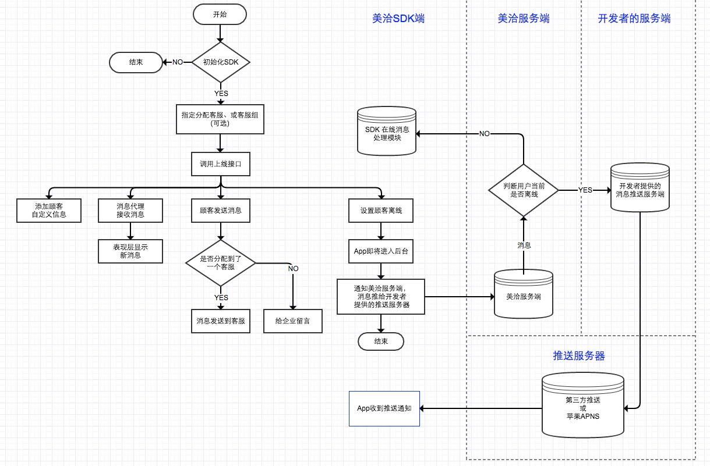

#MeiQiaSDK []() [](https://github.com/Carthage/Carthage) [](#cocoapods) [](https://github.com/Meiqia/MeiqiaSDK-iOS/releases)

> 在您阅读此文档之前，我们假定您已经具备了基础的 iOS 应用开发经验，并能够理解相关基础概念。

> 如有疑问，欢迎加入 美洽 SDK 开发 QQ 群：295646206

> *请注意，如果你是旧版 SDK 更换到新版 SDK，我们的推送数据格式统一成了 JSON 格式，具体请参见[消息推送](#消息推送)


## 目录
* [SDK 工作流程](#sdk-工作流程)
* [手动导入美洽 SDK](#导入美洽-sdk)
* [CocoaPods 导入](#CocoaPods-导入)
* [快速集成 SDK](#快速集成-sdk)
* [名词解释](#名词解释)
* [美洽开源聊天界面集成客服功能](#使用美洽开源聊天界面集成客服功能)
* [美洽 API 接口介绍](#美洽-api-接口介绍)
* [消息推送](#消息推送)
* [留言表单](#留言表单)
* [常见问题](#常见问题)
* [更新日志](#更新日志)

# SDK 工作流程

美洽 SDK 的工作流程如下图所示。



说明：
* 自定义用户数据将会在美洽客服工作台上显示；
* 当打开美洽推送服务后，客服发送的消息，将会发送至开发者的推送服务器。如果开发者需要推送，请务必在美洽工作台中设置推送的服务器地址，请使用美洽管理员帐号登录[美洽](http://www.meiqia.com)，在「设置」-「SDK」中设置。


# 手动导入美洽 SDK

## 文件介绍

Demo中的文件 | 说明
---- | -----
[MeiQiaSDK.framework](https://github.com/Meiqia/MeiqiaSDK-iOS/tree/master/Meiqia-SDK-Demo/MeiQiaSDK.framework) | 美洽 SDK 的 framework 。
[MQChatViewController/](https://github.com/Meiqia/MeiqiaSDK-iOS/tree/master/Meiqia-SDK-Demo/MQChatViewController) | 美洽提供的开源聊天界面 Library，详细介绍请移步 [github](https://github.com/Meiqia/MQChatViewController) 。
[MeiqiaSDKViewInterface](https://github.com/Meiqia/MeiqiaSDK-iOS/tree/master/Meiqia-SDK-Demo/MeiqiaSDKViewInterface) | 美洽的 SDK 逻辑接口层 与 开源聊天 Library 的中间层，调用美洽 SDK 的接口，完成界面所需的功能。
[MQMessageForm](https://github.com/Meiqia/MeiqiaSDK-iOS/tree/master/Meiqia-SDK-files/MQMessageForm) | 留言表单


framework中的文件 | 说明
---- | -----
[MQManager.h](https://github.com/Meiqia/MeiqiaSDK-iOS/blob/master/Meiqia-SDK-Demo/MeiQiaSDK.framework/Headers/MQManager.h) | 美洽 SDK 提供的逻辑 API，开发者可调用其中的逻辑接口，实现自定义在线客服界面
[MCDefination.h](https://github.com/Meiqia/MeiqiaSDK-iOS/blob/master/Meiqia-SDK-Demo/MeiQiaSDK.framework/Headers/MQDefinition.h) | 美洽 SDK 所用的枚举分类
[MQAgent.h](https://github.com/Meiqia/MeiqiaSDK-iOS/blob/master/Meiqia-SDK-Demo/MeiQiaSDK.framework/Headers/MQAgent.h) | 实体类：客服
[MQMessage.h](https://github.com/Meiqia/MeiqiaSDK-iOS/blob/master/Meiqia-SDK-Demo/MeiQiaSDK.framework/Headers/MQMessage.h) | 实体类：消息


## 导入美洽 SDK

### Objective-C 项目

把美洽 SDK 文件夹中的 `MeiQiaSDK.framework` 、 `MQChatViewController/` 和 `MeiqiaSDKViewInterface/` 文件夹（选做）拷贝到新创建的工程路径下面，然后在工程目录结构中，右键选择 *Add Files to “工程名”* 。或者将这两个个文件拖入 Xcode 工程目录结构中。

### Swift 项目

* 按照上面的方法引入美洽 SDK 的文件。
* 在 Bridging Header 头文件中，‘#import <MeiQiaSDK/MQManager.h>’、'#import "MQChatViewManager.h"'。注：[如何添加 Bridging Header](http://bencoding.com/2015/04/15/adding-a-swift-bridge-header-manually/)。

## 引入依赖库

美洽 SDK 的实现，依赖了一些系统框架，在开发应用时，要在工程里加入这些框架。开发者首先点击工程右边的工程名,然后在工程名右边依次选择 *TARGETS* -> *BuiLd Phases* -> *Link Binary With Libraries*，展开 *LinkBinary With Libraries* 后点击展开后下面的 *+* 来添加下面的依赖项:

- libsqlite3.tbd
- libicucore.tbd
- AVFoundation.framework
- CoreTelephony.framework
- SystemConfiguration.framework
- MobileCoreServices.framework
- QuickLook.framework

# CocoaPods 导入

在 Podfile 中加入：

```
pod 'Meiqia', '~> 3.3.4'
```

接着安装美洽 pod 即可：

```
$ pod install
```

# Carthage 集成

在 Cartfile 中增加:

```
github "meiqia/MeiqiaSDK-iOS"
```

2. 将 Meiqia.framework 中的 MeiQiaSDK.framework 拖到与Meiqia.framework 同一级目录

3. 将 Meiqia.framework 和 MeiQiaSDK.framework 两个包拖入工程中

4. 将 Meiqia.framework 拖入 Embedded Binearies 中


# 快速集成 SDK

美洽开源了一套[聊天界面 Library](https://github.com/Meiqia/MQChatViewController)，帮助开发者快速生成聊天视图，并提供自定义接口，满足一定定制需求。

**注意：**
* 如果开发者对美洽的开源界面进行了定制，最好 Fork 一份 github 上的代码。这以后美洽对开源界面进行了更新，开发者只需 merge 美洽的代码，就可以免去定制后更新的麻烦。

## 三分钟快速应用 SDK

如上所述，使用美洽 SDK ，必不可少的一步便是[初始化 SDK](#初始化-sdk)，完成初始化后便可操作 SDK 其他功能和接口，比如退出视图等。美洽提供的 UI 简化了开发流程，使得为 APP 添加客服功能最低仅需几行代码和一个 `info.plist` 配置：

```objc
//在AppDelegate.m增加如下 SDK 设置
- (BOOL)application:(UIApplication *)application didFinishLaunchingWithOptions:(NSDictionary *)launchOptions {
[MQManager initWithAppkey:@"开发者的美洽AppKey" completion:^(NSString *clientId, NSError *error) {
}];
return YES;
}

//App 进入后台时，关闭美洽服务
- (void)applicationDidEnterBackground:(UIApplication *)application {
[MQManager closeMeiqiaService];
}

//App 进入前台时，开启美洽服务
- (void)applicationWillEnterForeground:(UIApplication *)application {
[MQManager openMeiqiaService];
}
```

```objc
//在开发者需要调出聊天界面的位置，增加如下代码
MQChatViewManager *chatViewManager = [[MQChatViewManager alloc] init];
[chatViewManager pushMQChatViewControllerInViewController:self];
```

### info.plist设置

美洽的图片、语音等静态资源放在了 AWS S3 上，但 `s3.amazonaws.com` 使用了 SHA1 证书，不满足 iOS 9 的 [ATS ( App Transport Security )](https://developer.apple.com/library/prerelease/ios/releasenotes/General/WhatsNewIniOS/Articles/iOS9.html#//apple_ref/doc/uid/TP40016198-SW14) 要求。

所以为了能让聊天界面正确显示图片和语音，开发者需要在 App 的 info.plist 中增加如下设置 (右键点击`info.plist` -> `Open As` -> `Source Code`):

```xml
<key>NSAppTransportSecurity</key>
<dict>
<key>NSExceptionDomains</key>
<dict>
<key>s3.cn-north-1.amazonaws.com.cn</key>
<dict>
<key>NSExceptionRequiresForwardSecrecy</key>
<false/>
</dict>
</dict>
</dict>
```
添加完成后，info.plist显示效果如图：


关于 S3 证书问题，可参考 stackoverflow 上面的一个 [讨论](http://stackoverflow.com/questions/32500655/ios-9-app-download-from-amazon-s3-ssl-error-tls-1-2-support)。

至此，你已经为你的 APP 添加美洽提供的客服服务。而美洽 SDK 还提供其他强大的功能，可以帮助提高服务效率，提升用户使用体验。接下来为你详细介绍如何使用其他功能。


# 名词解释

### 开发者的推送消息服务器

目前美洽是把 SDK 的 `离线消息` 通过 webhook 形式发送给 - 开发者提供的 URL。

接收美洽 SDK 离线消息的服务器即为 `开发者的推送消息服务器`。


### 客服 id

美洽企业每一位注册客服均有一个唯一 id。通过此 id 开发者可用 SDK 接口指定分配对话给该客服。


### 客服组 id

美洽工作台支持为不同的客服分组，每一个组都有一个唯一id。通过此 id 开发者可用 SDK 接口指定分配对话给该客服组。


### 美洽顾客 id

美洽 SDK 在上线后（或称为分配对话后），均有一个唯一 id。

开发者可保存此 id，在其他设备上进行上线操作。这样此 id 的顾客信息和历史对话，都会同步到其他设备。


### 开发者自定义 id

即开发者自己定义的 id，例如开发者账号系统下的 user_id。

开发者可用此 id 进行上线，上线成功后，此 id 会绑定一个 `美洽顾客 id`。开发者在其他设备用自己的 id 上线后，可以同步之前的数据。

**注意**，如果开发者自己的 id 过于简单（例如自增长的数字），安全起见，建议开发者保存 `美洽顾客 id`，来进行上线操作。


# 使用美洽开源聊天界面集成客服功能

此小节介绍如何使用美洽的开源聊天界面快速集成客服功能。

## 初始化 SDK

**注意：**
* 所有操作都必须在初始化 SDK ，并且美洽服务端返回可用的 clientId 后才能正常执行。

开发者在美洽工作台注册 App 后，可获取到一个可用的 AppKey。在 `AppDelegate.m` 的系统回调 `didFinishLaunchingWithOptions` 中调用初始化 SDK 接口：

```objc
[MQManager initWithAppkey:@"开发者注册的App的AppKey" completion:^(NSString *clientId, NSError *error) {
}];
```

如果您不知道 *AppKey* ，请使用美洽管理员帐号登录 [美洽](http://www.meiqia.com)，在「设置」 -> 「SDK」 菜单中查看。如下图：


## 上传设备的 deviceToken

App 进入后台后，美洽推送给开发者服务端的消息数据格式中，会有 deviceToken 的字段。

将下列代码添加到 `AppDelegate.m` 中系统回调 `didRegisterForRemoteNotificationsWithDeviceToken` 中：

```objc
[MQManager registerDeviceToken:deviceToken];
```

美洽推送消息给开发者服务端的数据格式，可参考 [推送消息数据结构](#推送消息数据结构)。


## 添加自定义信息
功能效果展示：


为了让客服能更准确帮助用户，开发者可上传不同用户的属性信息。示例如下：

```objc
//创建自定义信息
NSDictionary* clientCustomizedAttrs = @{
@"name"        : @"Kobe Bryant",
@"avatar"      : @"http://meiqia.com/avatar.png",
@"身高"         : @"1.98m",
@"体重"         : @"93.0kg",
@"效力球队"      : @"洛杉矶湖人队",
@"场上位置"      : @"得分后卫",
@"球衣号码"      : @"24号"
};
[MQManager setClientInfo:clientCustomizedAttrs completion:^(BOOL success) {
}];
```

以下字段是美洽定义好的，开发者可通过上方提到的接口，直接对下方的字段进行设置：

|Key|说明|
|---|---|
|name|真实姓名|
|gender|性别|
|age|年龄|
|tel|电话|
|weixin|微信|
|weibo|微博|
|address|地址|
|email|邮件|
|weibo|微博|
|avatar|头像 URL|
|tags|标签，数组形式，且必须是企业中已经存在的标签|
|source|顾客来源|
|comment|备注|


## 指定分配客服和客服组

美洽默认会按照管理员设置的分配方式智能分配客服，但如果需要让来自 App 的顾客指定分配给某个客服或者某组客服，需要在上线前添加以下代码：

如果您使用美洽提供的 UI ，可对 UI 进行如下配置，进行指定分配：

```objc
MQChatViewManager *chatViewManager = [[MQChatViewManager alloc] init];
[chatViewManager setScheduledAgentToken:agentToken];
```

如果您自定义 UI，可直接使用如下美洽 SDK 逻辑接口：

```objc
//分配到指定客服，或指定组里面的客服，指定客服优先级高，并可选择分配失败后的转接规则
[MQManager setScheduledAgentWithAgentId:agentId agentGroupId:agentGroupId scheduleRule:rule];
```

**注意**
* 该选项需要在用户上线前设置。
* 客服组 ID 和客服 ID 可以通过管理员帐号在后台的「设置」中查看。


## 调出视图
美洽开源了一套 [聊天界面 Library](https://github.com/Meiqia/MQChatViewController)，完成了一整套 `MQManager` 中的接口。让开发者免去 UI 开发工作。并在 `MQChatViewController` 类中添加其他自定义选项和功能扩展。

你只需要在用户需要客服服务的时候，退出美洽 UI。如下所示：

```objc
//当用户需要使用客服服务时，创建并退出视图
MQChatViewManager *chatViewManager = [[MQChatViewManager alloc] init];
[chatViewManager pushMQChatViewControllerInViewController:self];
```

**注意**，如果这样不对 `MQChatViewManager` 进行任何配置直接调出视图，实际上是用美洽 初始化SDK后的顾客进行上线。如果开发者需要指定顾客上线，可参考:

[设置登录客服的开发者自定义 id](#设置登录客服的开发者自定义-id)

[设置登录客服的顾客 id](#设置登录客服的顾客-id)

`MQServiceToViewInterface` 文件是开源聊天界面调用美洽 SDK 接口的中间层，目的是剥离开源界面中的美洽业务逻辑。这样就能让该聊天界面用于非美洽项目中，开发者只需要实现 `MQServiceToViewInterface` 中的方法，即可将自己项目的业务逻辑和该聊天界面对接。

**更多开源聊天界面 Library 详细介绍和使用方法，请移步 [github](https://github.com/Meiqia/MQChatViewController)。**


## 配置开源 UI 实现更多客服功能
下面介绍开源 UI 中的美洽逻辑的配置，开发者可根据需求对其进行配置，再调出聊天视图。

### 开启同步服务端消息设置

如果开启消息同步，在聊天界面中下拉刷新，将会获取服务端的历史消息；

如果关闭消息同步，则是获取本机数据库中的历史消息；

由于顾客可能在多设备聊天，关闭消息同步后获取的历史消息，将可能少于服务端的历史消息。

```objc
MQChatViewManager *chatViewManager = [[MQChatViewManager alloc] init];
//开启同步消息
[chatViewManager enableSyncServerMessage:true];
[chatViewManager pushMQChatViewControllerInViewController:self];
```


### 指定分配客服和客服组设置

上文已有介绍，请参考 [指定分配客服和客服组](#指定分配客服和客服组)。


### 设置登录客服的开发者自定义 id

设置开发者自定义 id 后，将会以该自定义 id 对应的顾客上线。

**注意**，如果美洽服务端没有找到该自定义 id 对应的顾客，则美洽将会自动关联该 id 与 SDK 当前的顾客。

```objc
MQChatViewManager *chatViewManager = [[MQChatViewManager alloc] init];
[chatViewManager setLoginCustomizedId:customizedId];
[chatViewManager pushMQChatViewControllerInViewController:self];
```

使用该接口，可让美洽绑定开发者的用户系统和美洽的顾客系统。

**注意**，如果开发者的自定义 id 是自增长，美洽建议开发者服务端保存美洽顾客 id，登陆时 [设置登录客服的顾客 id](#设置登录客服的顾客-id)，否则非常容易受到中间人攻击。


### 设置登录客服的顾客 id

设置美洽顾客的 id 后，该id对应的顾客将会上线。

```objc
MQChatViewManager *chatViewManager = [[MQChatViewManager alloc] init];
[chatViewManager setLoginMQClientId:clientId];
[chatViewManager pushMQChatViewControllerInViewController:self];
```

**注意**，如果美洽服务端没有找到该顾客 id 对应的顾客，则会返回`该顾客不存在`的错误。

开发者需要获取 clientId，可使用接口`[MQManager getCurrentClientId]`。

### 设置自定义上传数据
```objc
MQChatViewManager *chatViewManager = [[MQChatViewManager alloc] init];
[chatViewManager setClientInfo:@{@"name":@"my name", @"tel":@"13333333333"}];
[chatViewManager pushMQChatViewControllerInViewController:self];
```
其中，系统定义 key 参见 [添加自定义信息](#添加自定义信息)

### 国际化

请参考 [美洽开源聊天界面的国际化说明](https://github.com/Meiqia/MQChatViewController#localization---国际化本地化)。

开源聊天界面的更多配置，可参见 [MQChatViewManager.h](https://github.com/Meiqia/MQChatViewController/blob/master/MQChatViewControllerDemo/MQChatViewController/Config/MQChatViewManager.h) 文件。

# 美洽 API 接口介绍

**本节主要介绍部分重要的接口。在`MeiqiaSDK.framework`的`MQManager.h`中，所有接口都有详细注释。**

开发者可使用美洽提供的 API，自行定制聊天界面。使用以下接口前，别忘了 [初始化 SDK](#初始化-sdk)。


## 接口描述

### 初始化SDK

美洽建议开发者在 `AppDelegate.m` 的系统回调 `didFinishLaunchingWithOptions` 中，调用初始化 SDK 接口。这是因为第一次初始化美洽 SDK，SDK 会向美洽服务端发送一个初始化顾客的请求，SDK 其他接口都必须是在初始化 SDK 成功后进行，所以 App 应尽早初始化 SDK 。

```objc
//建议在AppDelegate.m系统回调didFinishLaunchingWithOptions中增加
[MQManager initWithAppkey:@"开发者注册的App的AppKey" completion:^(NSString *clientId, NSError *error) {
}];
```

### 注册设备的 deviceToken

美洽需要获取每个设备的 deviceToken，才能在 App 进入后台以后，推送消息给开发者的服务端。消息数据中有 deviceToken 字段，开发者获取到后，可通知 APNS 推送给该设备。

在 AppDelegate.m中的系统回调 `didRegisterForRemoteNotificationsWithDeviceToken` 中，调用上传 deviceToken 接口：

```objc
[MQManager registerDeviceToken:deviceToken];
```

### 关闭美洽推送

详细介绍请见 [消息推送](#7-消息推送)。


### 指定分配客服和客服组接口

该接口上文已有介绍，请见 [指定分配客服和客服组](#指定分配客服和客服组)。


### 让当前的顾客上线。

初始化 SDK 成功后，SDK 中有一个可使用的顾客 id，调用该接口即可让其上线，如下代码：

```objc
[MQManager setCurrentClientOnlineWithCompletion:^(MQClientOnlineResult result, MQAgent *agent, NSArray<MQMessage *> *messages) {
//可根据result来判断是否上线成功
} receiveMessageDelegate:self];
```


### 根据美洽的顾客 id，登陆美洽客服系统，并上线该顾客。

开发者可通过 [获取当前顾客 id](#获取当前顾客-id) 接口，取得顾客 id ，保存到开发者的服务端，以此来绑定美洽顾客和开发者用户系统。
如果开发者保存了美洽的顾客 id，可调用如下接口让其上线。调用此接口后，当前可用的顾客即为开发者传的顾客 id。

```objc
[MQManager setClientOnlineWithClientId:clientId completion:^(MQClientOnlineResult result, MQAgent *agent, NSArray<MQMessage *> *messages) {
//可根据result来判断是否上线成功
} receiveMessageDelegate:self];
```


### 根据开发者自定义的 id，登陆美洽客服系统，并上线该顾客。

如果开发者不愿保存美洽顾客 id，来绑定自己的用户系统，也将用户 id当做参数，进行顾客的上线，美洽将会为开发者绑定一个顾客，下次开发者直接调用如下接口，就能让这个绑定的顾客上线。

调用此接口后，当前可用的顾客即为该自定义 id 对应的顾客 id。

**特别注意：**传给美洽的自定义 id 不能为自增长的，否则非常容易受到中间人攻击，此情况的开发者建议保存美洽顾客 id。

```objc
[MQManager setClientOnlineWithCustomizedId:customizedId completion:^(MQClientOnlineResult result, MQAgent *agent, NSArray<MQMessage *> *messages) {
//可根据result来判断是否上线成功
} receiveMessageDelegate:self];
```

### 监听顾客上线成功后的广播

开发者可监听顾客上线成功的广播，在上线成功后，可上传该顾客的自定义信息等操作。广播的名字为 `MQ_CLIENT_ONLINE_SUCCESS_NOTIFICATION`，定义在 [MQDefinition.h](https://github.com/Meiqia/MeiqiaSDK-iOS/blob/master/Meiqia-SDK-Demo/MeiQiaSDK.framework/Headers/MQDefinition.h) 中。

### 获取当前顾客 id

开发者可通过此接口接口，取得顾客 id，保存到开发者的服务端，以此来绑定美洽顾客和开发者用户系统。

```objc
NSString *clientId = [MQManager getCurrentClientId];
```


### 创建一个新的顾客

如果开发者想初始化一个新的顾客，可调用此接口。

该顾客没有任何历史记录及用户信息。

开发者可选择将该 id 保存并与 App 的用户绑定。

```objc
[MQManager createClient:^(BOOL success, NSString *clientId) {
//开发者可保存该clientId
}];
```


### 设置顾客离线

```objc
NSString *clientId = [MQManager setClientOffline];
```

如果没有设置顾客离线，开发者设置的代理将收到即时消息，并收到新消息产生的广播。开发者可以监听此 notification，用于显示小红点未读标记。

如果设置了顾客离线，则客服发送的消息将会发送给开发者的服务端。

`美洽建议`，顾客退出聊天界面时，不设置顾客离线，这样开发者仍能监听到收到消息的广播，以便提醒顾客有新消息。


### 监听收到消息的广播

开发者可在合适的地方，监听收到消息的广播，用于提醒顾客有新消息。广播的名字为 `MQ_RECEIVED_NEW_MESSAGES_NOTIFICATION`，定义在 [MQDefinition.h](https://github.com/Meiqia/MeiqiaSDK-iOS/blob/master/Meiqia-SDK-Demo/MeiQiaSDK.framework/Headers/MQDefinition.h) 中。

开发者可获取广播中的userInfo，来获取收到的消息数组，数组中是美洽消息 [MQMessage](https://github.com/Meiqia/MeiqiaSDK-iOS/blob/master/Meiqia-SDK-Demo/MeiQiaSDK.framework/Headers/MQMessage.h) 实体，例如：`[notification.userInfo objectForKey:@"messages"]`

**注意**，如果顾客退出聊天界面，开发者没有调用设置顾客离线接口的话，以后该顾客收到新消息，仍能收到`有新消息的广播`。

``` objc

#pragma 在合适的地方监听有新消息的广播
[[NSNotificationCenter defaultCenter] addObserver:self selector:@selector(didReceiveNewMQMessages:) name:MQ_RECEIVED_NEW_MESSAGES_NOTIFICATION object:nil];

#pragma 监听收到美洽聊天消息的广播
- (void)didReceiveNewMQMessages:(NSNotification *)notification {
//广播中的消息数组
NSArray *messages = [notification.userInfo objectForKey:@"messages"];
NSLog(@"监听到了收到客服消息的广播");
}

```

### 获取当前正在接待的客服信息

开发者可用此接口获取当前正在接待顾客的客服信息：

```objc
MQAgent *agent = [MQManager getCurrentAgent];
```


### 添加自定义信息

添加自定义信息操作和上述相同，跳至 [添加自定义信息](#添加自定义信息)。


### 从服务端获取更多消息

开发者可用此接口获取服务端的历史消息：

```objc
[MQManager getServerHistoryMessagesWithUTCMsgDate:firstMessageDate messagesNumber:messageNumber success:^(NSArray<MQMessage *> *messagesArray) {
//显示获取到的消息等逻辑
} failure:^(NSError *error) {
//进行错误处理
}];
```

**注意**，服务端的历史消息是该顾客在**所有平台上**产生的消息，包括网页端、Android SDK、iOS SDK、微博、微信，可在聊天界面的下拉刷新处调用。


### 从本地数据库获取历史消息

由于使用 [从服务端获取更多消息](#从服务端获取更多消息)接口，会产生数据流量，开发者也可使用此接口来获取 iOS SDK 本地的历史消息。

```objc
[MQManager getDatabaseHistoryMessagesWithMsgDate:firstMessageDate messagesNumber:messageNumber result:^(NSArray<MQMessage *> *messagesArray) {
//显示获取到的消息等逻辑
}];
```

**注意**，由于没有同步服务端的消息，所以本地数据库的历史消息有可能少于服务端的消息。

### 接收即时消息

开发者可能注意到了，使用上面提到的3个顾客上线接口，都有一个参数是`设置接收消息的代理`，开发者可在此设置接收消息的代理，由代理来接收消息。

设置代理后，实现 `MQManagerDelegate` 中的 `didReceiveMQMessage:` 方法，即可通过这个代理函数接收消息。


### 发送消息

开发者调用此接口来发送**文字消息**：

```objc
[MQManager sendTextMessageWithContent:content completion:^(MQMessage *sendedMessage) {
//消息发送成功后的处理
}];
```

开发者调用此接口来发送**图片消息**：

```objc
[MQManager sendImageMessageWithImage:image completion:^(MQMessage *sendedMessage) {
//消息发送成功后的处理
}];
```

开发者调用此接口来发送**语音消息**：

```objc
[MQManager sendAudioMessage:audioData completion:^(MQMessage *sendedMessage, NSError *error) {
//消息发送成功后的处理
}];
```

**注意**，调用发送消息接口后，回调中会返回一个消息实体，开发者可根据此消息的状态，来判断该条消息是发送成功还是发送失败。

### 获取未读消息数

开发者使用此接口来统一获取所有的未读消息，用户可以在需要显示未读消息数是调用此接口，此接口会自动判断并合并本地和服务器上的未读消息，当用户进入聊天界面后，未读消息将会清零。
`[MQManager getUnreadMessagesWithCompletion:completion]`

###录音和播放录音

录音和播放录音分别包含 3 种可配置的模式：
- 暂停其他音频
- 和其他音频同时播放
- 降低其他音频声音

用户可以根据情况选择，在 `MQChatViewManager.h` 中直接配置以下两个属性：

`@property (nonatomic, assign) MQPlayMode playMode;`

`@property (nonatomic, assign) MQRecordMode recordMode;`

如果宿主应用本身也有声音播放，比如游戏，为了不影响背景音乐播放，可以设置 `@property (nonatomic, assign) BOOL keepAudioSessionActive;` 为 `YES` 这样就不会再完成播放和录音之后关闭 AudioSession，从而不会影响背景音乐。

**注意，游戏中，要将声音播放的 category 设置为 play and record，否则会导致录音之后无法播放声音。**


### 预发送消息

在 `MQChatViewManager.h` 中， 通过设置 `@property (nonatomic, strong) NSArray *preSendMessages;` 来让客户显示聊天窗口的时候，自动向客服发送消息，支持文字和图片。

### 监听聊天界面显示和消失

* `MQ_NOTIFICATION_CHAT_BEGIN` 在聊天界面出现的时候发送
* `MQ_NOTIFICATION_CHAT_END` 在聊天界面消失时发送


### 用户排队

监听消息:
当用户被客服接入时，会受到 `MQ_NOTIFICATION_QUEUEING_END` 通知。


# SDK 中嵌入美洽 SDK
如果你的开发项目也是 SDK，那么在了解常规 App 嵌入美洽 SDK 的基础上，还需要注意其他事项。

与 App 嵌入美洽 SDK 的步骤相同，需要 导入美洽 SDK -\> 引入依赖库 -\> 初始化 SDK -\> 使用美洽 SDK。

如果开发者使用了美洽提供的聊天界面，还需要公开素材包：

开发者点击工程右边的工程名,然后在工程名右边依次选择 *TARGETS* -\> *BuiLd Phases* -\> *Copy Files* ，展开 *Copy Files* 后点击展开后下面的 *+* 来添加美洽素材包 `MQChatViewAsset.bundle`。

在之后发布你的 SDK 时，将 `MQChatViewAsset.bundle` 一起打包即可。


# 消息推送

当前仅支持一种推送方案，即美洽服务端发送消息至开发者的服务端，开发者再推送消息到 App，可见 [SDK 工作流程](#SDK-工作流程) 。

未来美洽 iOS SDK 将会支持直接推送消息给 App，即开发者可上传 App 的推送证书至美洽，美洽将推送消息至苹果 APNS 服务器。目前正在紧张开发中。

### 设置接收推送的服务器地址

推送消息将会发送至开发者的服务器。

设置服务器地址，请使用美洽管理员帐号登录 [美洽](http://www.meiqia.com)，在「设置」 -\> 「SDK」中设置。


### 通知美洽服务端发送消息至开发者的服务端

目前，美洽的推送是通过推送消息给开发者提供的 URL 上来实现的。

在 App 进入后台时，应该通知美洽服务端，让其将以后的消息推送给开发者提供的服务器地址。

开发者需要在 `AppDelegate.m` 的系统回调 `applicationDidEnterBackground` 调用关闭美洽服务接口，如下代码：

```objc
- (void)applicationDidEnterBackground:(UIApplication *)application {
[MQManager closeMeiQiaService];
}
```

### 关闭美洽推送

在 App 进入前台时，应该通知美洽服务端，让其将以后的消息发送给SDK，而不再推送给开发者提供的服务端。

开发者需要在 `AppDelegate.m` 的系统回调 `applicationWillEnterForeground` 调用开启美洽服务接口，如下代码：

```objc
- (void)applicationWillEnterForeground:(UIApplication *)application {
[MQManager openMeiQiaService];
}
```


#### 推送消息数据结构

当有消息需要推送时，美洽服务器会向开发者设置的服务器地址发送推送消息，方法类型为 *POST*，数据格式为 *JSON* 。

发送的请求格式介绍：

request.header.authorization 为数据签名。

request.body 为消息数据，数据结构为：

|Key|说明|
|---|---|
|messageId|消息 id|
|content|消息内容|
|messageTime|发送时间|
|fromName|发送人姓名|
|deviceToken|发送对象设备的 deviceToken，格式为字符串|
|clientId|发送对象的顾客 id|
|customizedId|开发者传的自定义 id|
|contentType|消息内容类型 - text/photo/audio|
|deviceOS|设备系统|
|customizedData|开发者上传的自定义的属性|
|type|消息类型 - mesage 普通消息 / welcome 欢迎消息 / ending 结束消息 / remark 评价消息 / 留言消息|

开发者可以根据请求中的签名，对推送消息进行数据验证，美洽提供了 `Java、Python、Ruby、JavaScript、PHP` 5种语言的计算签名的代码，具体请移步 [美洽 SDK 3.0 推送的数据结构签名算法](https://github.com/Meiqia/MeiqiaSDK-Push-Signature-Example)。

# 留言表单

目前是两种模式：

1. 完全对话模式：
	* 无机器人时：如果当前客服不在线，直接聊天界面输入就是留言，客服上线后能够直接回复，如果客服在线，则进入正常客服对话模式。
	* 有机器人时：如果当前客服不在线，直接聊天界面输入的话，还是由机器人回答，顾客点击留言就会跳转到表单。

2. 单一表单模式：
不管客服是否在线都会进入表单，顾客提交后，不会有聊天界面。这种主要用于一些 App 只需要用户反馈，不需要直接回复的形式。

### 设置留言表单引导文案

配置了该引导文案后将不会读取工作台配置的引导文案。
最佳实践：尽量不要在 SDK 中配置引导文案，而是通过工作台配置引导文案，方便在节假日的时候统一配置各端的引导文案，避免重新打包发布 App。

```objc
MQMessageFormViewManager *messageFormViewManager = [[MQMessageFormViewManager alloc] init];
[messageFormViewManager setLeaveMessageIntro:@"我们的在线时间是周一至周五 08:30 ~ 19:30, 如果你有任何需要，请给我们留言，我们会第一时间回复你"];
[messageFormViewManager pushMQMessageFormViewControllerInViewController:self];
```

### 设置留言表单的自定义输入信息

开发者可根据此接口设置留言表单的自定义输入信息。如果不设置该参数，默认有「留言」、「手机」、「邮箱」这三个文本输入框。MQMessageFormInputModel 中 key 的值参考 [添加自定义信息](#添加自定义信息)。

```objc
MQMessageFormInputModel *phoneMessageFormInputModel = [[MQMessageFormInputModel alloc] init];
phoneMessageFormInputModel.tip = @"手机";
phoneMessageFormInputModel.key = @"tel";
phoneMessageFormInputModel.isSingleLine = YES;
phoneMessageFormInputModel.placeholder = @"请输入你的手机号";
phoneMessageFormInputModel.isRequired = YES;
phoneMessageFormInputModel.keyboardType = UIKeyboardTypePhonePad;

NSMutableArray *customMessageFormInputModelArray = [NSMutableArray array];
[customMessageFormInputModelArray addObject:phoneMessageFormInputModel];

MQMessageFormViewManager *messageFormViewManager = [[MQMessageFormViewManager alloc] init];
[messageFormViewManager setCustomMessageFormInputModelArray:customMessageFormInputModelArray];
[messageFormViewManager pushMQMessageFormViewControllerInViewController:self];
```

### 设置留言表单主题

如果同时配置了聊天界面和留言表单界面的主题，优先使用留言表单界面的主题。如果两个主题都没有设置，则使用默认的主题。

```objc
MQMessageFormViewManager *messageFormViewManager = [[MQMessageFormViewManager alloc] init];
messageFormViewManager.messageFormViewStyle = [MQMessageFormViewStyle greenStyle];
messageFormViewManager.messageFormViewStyle.navTitleColor = [UIColor orangeColor];
[messageFormViewManager pushMQMessageFormViewControllerInViewController:self];
```

# 常见问题

- [SDK 初始化失败](#sdk-初始化失败)
- [没有显示 导航栏栏/UINavgationBar](#没有显示-导航栏栏uinavgationbar)
- [Xcode Warning: was built for newer iOS version (7.0) than being linked (6.0)](#xcode-warning-was-built-for-newer-ios-version-70-than-being-linked-60)
- [美洽静态库的文件大小太大](#美洽静态库的文件大小太大)
- [使用 TabBarController 后，输入框高度出现异常](#使用-tabbarcontroller-后inputbar-高度出现异常)
- [键盘弹起后输入框和键盘之间有偏移](#键盘弹起后输入框和键盘之间有偏移)
- [如何得到客服 id 或客服分组 id](#如何得到客服id或客服分组id)
- [如何在聊天界面之外监听新消息的通知](#如何在聊天界面之外监听新消息的通知)
- [指定分配客服/客服组失效](#指定分配客服/客服组失效)
- [第三方库冲突](#第三方库冲突)
- [工作台顾客信息显示应用的名称不正确](#工作台顾客信息显示应用的名称不正确)
- [编译中出现 undefined symbols](#编译中出现-undefined-symbols)

## SDK 初始化失败

### 1. 美洽的 AppKey 版本不正确
当前SDK是为美洽 3.0 提供服务，如果你使用的 AppKey 是美洽 2.0 「经典版」的，请使用美洽 2.0 「经典版」SDK

传送门：

* [新版注册入口](https://app.meiqia.com/signup)
* [经典版注册入口](http://meiqia.com/signup)

### 2. 没有配置 NSExceptionDomains
如果没有配置`NSExceptionDomains`，美洽SDK会返回`MQErrorCodePlistConfigurationError`，并且在控制台中打印：`!!!美洽 SDK Error：请开发者在 App 的 info.plist 中增加 NSExceptionDomains，具体操作方法请见「https://github.com/Meiqia/MeiqiaSDK-iOS#info.plist设置」`。如果出现上诉情况，请 [配置NSExceptionDomains](#infoplist设置)

**注意**，如果发现添加配置后，仍然打印配置错误，请开发者检查是否错误地将配置加进了项目 Tests 的 info.plist 中去。

### 3. 网络异常
如果上诉情况均不存在，请检查引入美洽SDK的设备的网络是否通畅

## 没有显示 导航栏/UINavgationBar
美洽开源的聊天界面用的是系统的 `UINavgationController`，所以没有显示导航栏的原因有3种可能：

* 如果使用的是`Push`方式弹出视图，那么可能是传入 `viewController` 没有基于 `UINavigationController`。
* 如果使用的是`Push`方式弹出视图，那么可能是 `UINavgationBar` 被隐藏或者是透明的。
* App中使用了 `Category`，对 `UINavgationBar` 做了修改，造成无法显示。

其中1、2种情况，除了修改代码，还可以直接使用 `present` 方式弹出视图解决。

## Xcode Warning: was built for newer iOS version (7.0) than being linked (6.0)

如果开发者的 App 最低支持系统是 7.0 以下，将会出现这种 warning。

`ld: warning: object file (/Meiqia-SDK-Demo/MQChatViewController/Vendors/MLAudioRecorder/amr_en_de/lib/libopencore-amrnb.a(wrapper.o)) was built for newer iOS version (7.0) than being linked (6.0)`

原因是美洽将 SDK 中使用的开源库 [opencore-amr](http://sourceforge.net/projects/opencore-amr/) 针对支持Bitcode而重新编译了一次，但这并不影响SDK在iOS 6中的使用。如果你介意，并且不会使用 Bitcode，可以将美洽SDK中使用 `opencore-amr` 替换为老版本：[传送门](https://github.com/molon/MLAudioRecorder/tree/master/MLRecorder/MLAudioRecorder/amr_en_de/lib)

## 美洽静态库的文件大小太大
因为美洽静态库包含5个平台（armv7、arm64、i386、x86_64）+ Bitcode。但这并不代表会严重影响编译后的宿主 App 大小，实际上，这只会增加宿主 App 100kb 左右大小。

## 键盘弹起后输入框和键盘之间有偏移
请检查是否使用了第三方开源库[IQKeyboardManager](https://github.com/hackiftekhar/IQKeyboardManager)，该开源库会和判断输入框的逻辑冲突。

解决办法：（感谢 [RandyTechnology](https://github.com/RandyTechnology) 向我们提供该问题的原因和解决方案）

* 在MQChatViewController的viewWillAppear里加入 `[[IQKeyboardManager sharedManager] setEnable:NO];`，作用是在当前页面禁止IQKeyboardManager
* 在MQChatViewController的viewWillDisappear里加入 `[[IQKeyboardManager sharedManager] setEnable:YES];`，作用是在离开当前页面之前重新启用IQKeyboardManager

## 使用 TabBarController 后，inputBar 高度出现异常

使用了 TabBarController 的 App，视图结构都各相不同，并且可能存在自定义 TabBar 的情况，所以美洽 SDK 无法判断并准确调整，需要开发者自行修改 App 或 SDK 代码。自 iOS 7 系统后，大多数情况下只需修改 TabBar 的 `hidden` 和 `translucent` 属性便可以正常使用。

## 如何得到客服ID或客服分组ID

请查看 [指定分配客服和客服组](#指定分配客服和客服组) 中的配图。

## 如何在聊天界面之外监听新消息的通知

请查看 [如何监听监听收到消息的广播](#监听收到消息的广播)。

## 指定分配客服/客服组失效

请查看指定的客服的服务顾客的上限是否被设置成了0，或服务顾客的数量是否已经超过服务上限。查看位置为：`工作台 - 设置 - 客服与分组 - 点击某客服`

## 第三方库冲突

由于「聊天界面」的项目中用到了几个开源库，如果开发者使用相同的库，会产生命名空间冲突的问题。遇到此类问题，开发者可以选择删除「聊天界面 - Vendors」中的相应第三方代码。

**注意**，美洽对几个第三方库进行了自定义修改，如果开发者删除了美洽中的 Vendors，聊天界面将会缺少我们自定义的效果，详细请移步 Github [美洽开源聊天界面](https://github.com/Meiqia/MQChatViewController#vendors---用到的第三方开源库)。

## 工作台顾客信息显示应用的名称不正确

如果工作台的某对话中的顾客信息 - 访问信息中的「应用」显示的是 App 的 Bundle Name 或显示的是「SDK 无法获取 App 的名字」，则可能是您的 App 的 info.plist 中没有设置 CFBundleDisplayName 这个 Property，导致 SDK 获取不到 App 的名字。

## 编译中出现 undefined symbols

请开发者检查 App Target - Build Settings - Search Path - Framework Search Path 或 Library Search Path 当中是否没有美洽的项目。

Vendors - 用到的第三方开源库
---
以下是该 Library 用到的第三方开源代码，如果开发者的项目中用到了相同的库，需要删除一份，避免类名冲突：

第三方开源库 | Tag 版本 | 说明
----- | ----- | -----
VoiceConvert |  N/A | AMR 和 WAV 语音格式的互转；没找到出处，哪位童鞋找到来源后，请更新下文档~
[MLAudioRecorder](https://github.com/molon/MLAudioRecorder) | master | 边录边转码，播放网络音频 Button (本地缓存)，实时语音。**注意**，由于该开源项目中的 [lame.framework](https://github.com/molon/MLAudioRecorder/tree/master/MLRecorder/MLAudioRecorder/mp3_en_de/lame.framework) 不支持 `bitCode` ，所以我们去掉了该项目中有关 MP3 的文件；
[GrowingTextView](https://github.com/HansPinckaers/GrowingTextView) | 1.1 | 随文字改变高度的的 textView，用于本项目中的聊天输入框；
[TTTAttributedLabel](https://github.com/TTTAttributedLabel/TTTAttributedLabel) |  | 支持多种效果的 Lable，用于本项目中的聊天气泡的文字 Label；
[CustomIOSAlertView](https://github.com/wimagguc/ios-custom-alertview) | 自定义 | 自定义的 AlertView，用于显示本项目的评价弹出框；**注意**，我们队该开源项目进行了修改，增加了按钮之间的分隔线条、判断当前是否已经有 AlertView 在显示、以及键盘弹出时界面 frame 计算，该修改版本可以见 [CustomIOSAlertView](https://github.com/ijinmao/ios-custom-alertview)；
[AGEmojiKeyboard](https://github.com/ayushgoel/AGEmojiKeyboard)|0.2.0|表情键盘，布局进行自定义，源码可以在工程中查看；

# 更新日志

**v3.3.4 2016 年 12 月 7 日**

* 修复发送图片，语音失败。

**V3.3.3 2016 年 12 月 2 日**

* 修复进入后台之后，ticket 回复不能马上收到。
* 其他小问题.

**v3.3.2 2016 年 10 月 19 日** 

* 增加留言表单中工单类型选择。
* 多企业支持切换。
* 增加工单相关接口。
* 修复问题:
	- 偶发的文字截断 
	- 用户设置上传之后立刻获取无法获取到。
	- 留言表单返回按钮的图片没有自动获取聊天界面用户设置的自定义图片。
	- 导航栏右侧按钮，如果是自定义按钮，在分配机器人是没有显示转接人工，并且转接客服之后消失。
	- 增加 socket 连接无法连接时的消息轮询机制，确保消息不丢失。

**v3.3.1 2016 年 09 月 18 日** 

* 增加机器人回复的图文聊天气泡
* 合并机器人回复图文气泡和评价按钮
* 修复已知问题

**v3.3.0 2016 年 08 月 19 日**

* 增加工单支持
* 增加询前表单
* 增加机器人图文消息支持
* 增加表情键盘
* **移除 iOS 6 支持**
* demo 工程处理了 iOS 10 中图片和相机申请权限的崩溃
* 修复已知问题

**v3.2.4 2016 年 08 月 1 日**

* 增加机器人未识别手动转人工

**v3.2.3 2016 年 07 月 22 日**

* 增加机器人自定义回复文案

**v3.2.2 2016 年 07 月 5 日**

* 增加图文消息显示的支持
* 修复部分问题
* 优化界面

**v3.2.1 2016 年 06 月 20 日**

* 支持排队功能
* 更新聊天输入界面
* 增加接收文件预览功能
* 修复问题

**v3.2.0 2016 年 05 月 30 日**

* 增加机器人客服
* 增加留言表单

**v3.1.9 2016 年 05 月 13 日**

* 聊天界面增加可交互转场动画
* 发送消息失败后，会提示客服下线
* 聊天界面优化
* 用户正在输入的提示请求，加一个发送限制
* 替换现有的图片全屏浏览组件
* 修改数据库结构，不再以版本号建库
* SDK 修改黑名单文案提示
* 聊天界面不定时在收到消息的时候会崩溃
* 增加导航栏标题文字字体的接口
* 修改导航栏左键接口

**v3.1.8 2016 年 04 月 22 日**

* 增加文件接收功能。
* 增加黑名单功能支持。
* 新增音频控制的接口。
* 新增界面主题，通过修改 chatViewStyle 的对应方法来定制聊天界面。
* 新增消息预发送的接口。
* 升级获取未读消息的接口。
* 修复聊天界面通过 push 显示的时候，没有调用 viewDidApear，viewWillApear，viewDidDisapper， viewWillDisappear。
* 修复在某些情况下聊天界面下方会出现黑条的问题。
* 修复在没有分配到客服的时候，不自动显示历史消息的问题。
* 修复客服不在线时，客服不在线提示没有自动滚动出现。
* 修复第二次进入聊天界面时，没有滚动到最下方的问题。
* 修复查看图片在横屏时无法正常显示的问题。
* 修复音频文件导致的调试断点问题。

**v3.1.7 2016 年 03 月 29 日**

* 解决单语言的项目获取不到 App 的基本信息的问题。
* 修复聊天界面从相册返回的时候界面上移的问题。
* 增加获取未读消息的接口。
* 修复在支持横屏的应用点击发送照片崩溃的问题。
* 修复断线重连的时候，如果客服状态改变了，客户端没有更新的问题。
* 修复客服转接后，客户名称没有正确更新。
* 修复图片，文字聊天气泡在旋转过后没有正确重绘。

**v3.1.6 2016 年 03 月 11 日**

* 解决横屏状态下，发送消息后没有滚动到底部的问题。
* 增加输入文字的缓存。

**v3.1.5 2016 年 03 月 09 日**

* 修改开源界面获取 Bundle 的方式，以支持 CocoaPods。
* 增加客服在线/隐身/离线状态

**v3.1.4 2016 年 03 月 02 日**

* 开源界面增加上传顾客自定义信息的接口，感谢 [dayuch](https://github.com/dayuch) 提交的 PR 。
* 更换提交客服评价后的表现形式。
* 增加录音模糊界面的开关接口。
* 更换新的发送/接收消息的提示音。

**v3.1.3 2016 年 02 月 25 日**

* 支持 Cocoapods. 感谢 [ttgb](https://github.com/ttgb) 的支持。
* 增加显示客服留言回复的功能。
* 修复使用自定义 id 上线后，第二次上线前获取不到数据库本地消息的问题。

**v3.1.2 2016 年 02 月 22 日**

* 修改第三方开源项目的类名，避免开发者和自己的项目冲突。

**v3.1.1 2016 年 02 月 17 日**

* 修复上传头像后，出现缺省头像的问题。
* 修复后端加密数据出错导致的 Crash 问题。
* 更新开源界面，方便开发者自定义导航栏的元素。

**v3.1.0 2016 年 01 月28 日**

* 增加客服评价功能。
* 修复 iOS 7 中打开系统相册后 Crash 的问题

**v3.0.9 2016 年 01 月 14 日**

* 聊天界面输入框的文字是多行时，保持输入框两侧按钮的位置在键盘上方。
* 重置 message 实体类中的 agentId 的值

**v3.0.8 2016 年 01 月 13 日**

* 增加「顾客上线」的接口描述。
* 增加「顾客上线成功」的广播。
* 对话没有结束情况下，如果客服隐身，仍然可以重新分配到该对话。
* 增加对服务端实体类型的容错。
* 顾客未上线，不进行下载顾客头像。
* 优化收到消息后，聊天界面滚动到底部的体验。

**v3.0.7 2016 年 01 月 11 日**

* 修复「断网重连，没有同步消息」的问题
* 修复使用新的自定义 id 上线，没有上报设备信息的问题
* 修复飞行模式下，发送失败的消息界面卡顿的问题

**v3.0.6 2016 年 01 月 06 日**

* 修复由于导航栏不透明导致的输入框下方有黑边问题。
* 增加指定分配客服、客服组接口的转接规则，即若指定分配的客服不在线时，如何转接。

**v3.0.5 2016 年 01 月 05 日**

* 重命名「开启/关闭美洽推送服务」为「开启/关闭美洽服务」，确保没有歧义
* 修改顾客自定义信息，以支持获取所有开发者上传的自定义信息

**v3.0.4 2015 年 12 月 31 日**

* 修复一些手机发送照片卡顿的问题。
* 复新建 client 情况下没有重新上传 deviceToken 的问题。

**v3.0.2 2015 年 12 月 30 日**

* 处理接口参数为 nil 的情况。
* 增加删除数据库 message 接口 removeMessageInDatabaseWithId 的结果回调。
* 修复上传自定义头像图片，聊天界面没有更新的问题。
* 上传 deviceToken 为字符串的形式。
